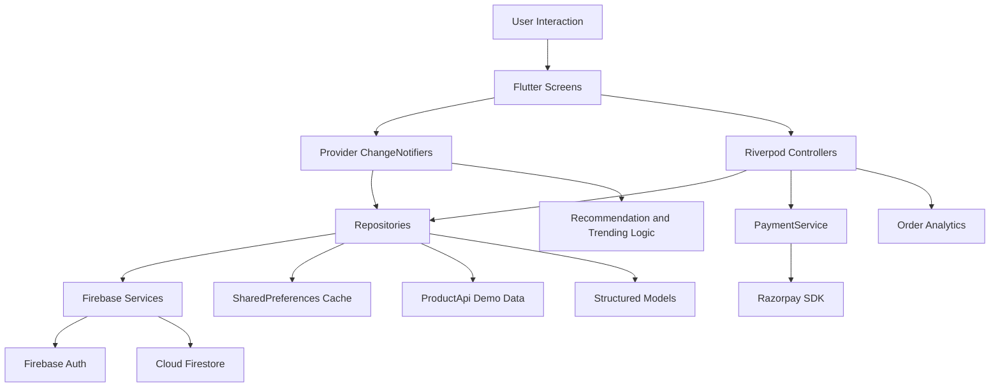

# ShopRite Flutter Ecommerce - Revision Documentation and Viva Report

## 1. Project Overview

ShopRite is a Flutter-based fashion ecommerce application built for browsing,
searching, recommending, buying, tracking, and analyzing fashion products. The
project is designed around a complete shopping journey instead of isolated
screens:

1. User opens the app and logs in or signs up.
2. Products are loaded from Firebase Firestore when available, with a demo API
   and local cache fallback.
3. The home page shows categories, banners, recommendations, search results,
   and trending products.
4. The user views product details, adds products to cart, and sees modern cart
   micro-interactions.
5. The cart collects quantity, subtotal, discount, delivery fee, and total.
6. Checkout collects delivery details and supports Razorpay Pay Now or Pay
   Later.
7. Orders can be tracked, pending payments can be completed, and admin users can
   inspect analytics.

The project avoids a template-generated feel through custom ecommerce flows,
custom product data, product-specific visual language, recommendation and
trending logic, checkout/payment state handling, analytics, and premium
micro-interactions.

## 2. Technology Stack

| Area | Technology | Project Usage |
|---|---|---|
| UI framework | Flutter | Cross-platform mobile/web UI |
| Language | Dart | Application logic, models, providers, repositories |
| State management | Provider, Riverpod | Provider for core app state; Riverpod for checkout/order/payment controllers |
| Backend | Firebase Auth, Cloud Firestore | Authentication, user documents, product collection |
| Local cache | SharedPreferences | Cached products, recent views, search history |
| Payments | Razorpay Flutter SDK | Test-mode Pay Now and pending order payment |
| Images | cached_network_image | Cached product, banner, and order images |
| Charts | fl_chart | Admin order analytics visualization |
| Connectivity | connectivity_plus | Offline detection and fallback messaging |
| Testing | flutter_test | Widget tests for happy path and edge cases |

## 3. Directory Architecture

```text
lib/
  app.dart                         Provider and route setup
  main.dart                        Firebase initialization and app bootstrap
  firebase_options.dart            Firebase project configuration

  core/
    constants/                     Colors, sizes, app strings
    theme/                         Light/dark app theme and text hierarchy
    utils/                         Validators, helpers, network checker

  models/                          Structured app data models
    product_model.dart
    cart_item_model.dart
    order_model.dart
    payment_model.dart
    user_model.dart

  providers/                       Provider ChangeNotifier app state
    auth_provider.dart
    product_provider.dart
    cart_provider.dart
    wishlist_provider.dart
    theme_provider.dart

  repositories/                    Data abstraction layer
    auth_repository.dart
    product_repository.dart
    cart_repository.dart
    order_repository.dart
    payment_repository.dart

  services/
    api/product_api.dart           Curated demo product data source
    firebase/auth_service.dart     Firebase Auth wrapper
    firebase/firestore_service.dart Firestore wrapper
    local/cache_service.dart       SharedPreferences cache
    payment_service.dart           Razorpay integration

  logic/
    recommendation_engine.dart     Personalized product scoring
    trending_algorithm.dart        Engagement-based trending ranking
    analytics_service.dart         Event logging helper

  domain/
    order_analytics.dart           Revenue, item, category analytics

  state/                           Riverpod checkout/order/payment state
    checkout_provider.dart
    order_provider.dart
    payment_provider.dart

  screens/                         Feature UI
    auth/
    home/
    product/
    cart/
    order/
    payment/
    profile/
    wishlist/
    admin/

  widgets/                         Reusable UI components
    app_background.dart
    animated_add_to_cart_button.dart
    cart_micro_interactions.dart
    custom_button.dart
    custom_textfield.dart
    error_widget.dart
    loading_widget.dart
```

## 4. Architecture Diagram



## 5. DoD Mapping

| Evaluation Point | Evidence in Project | Main Files |
|---|---|---|
| Functional completeness | Auth, product listing, search, cart, wishlist, checkout, orders, tracking, profile, admin analytics | `lib/screens/**`, `lib/routes/app_routes.dart` |
| Meaningful extensions | Recommendation engine, trending algorithm, Razorpay Pay Now/Pay Later, admin analytics, cart micro-interactions | `lib/logic/**`, `lib/state/**`, `lib/widgets/**` |
| Empty states | Empty cart, no orders, empty wishlist, no product matches, failed product load | `cart_screen.dart`, `order_screen.dart`, `wishlist_screen.dart`, `product_list_screen.dart` |
| No internet handling | Connectivity listener and cached product fallback | `product_provider.dart`, `product_repository.dart`, `cache_service.dart`, `network_checker.dart` |
| Invalid input | Login/signup validators, checkout phone/address validation | `validators.dart`, `login_screen.dart`, `signup_screen.dart`, `cart_screen.dart` |
| Custom UI/UX | Light/dark theme, image-wall auth background, banners, custom product cards, animations | `app_theme.dart`, `app_background.dart`, `banner_carousel.dart`, `product_card.dart` |
| State management | Provider and Riverpod with clear UI/business/data separation | `app.dart`, `providers/**`, `state/**` |
| Firebase | Firebase initialization, Auth, Firestore users/products | `main.dart`, `auth_repository.dart`, `product_repository.dart`, `firestore_service.dart` |
| Custom logic | Search-history recommendation and engagement-based trending | `recommendation_engine.dart`, `trending_algorithm.dart` |
| Visualization | Admin revenue/category/product charts | `order_screen.dart`, `order_analytics.dart` |
| Testing | 4 widget tests covering happy path and edge cases | `test/widget_test.dart` |
| Performance | Cached images, pagination, provider selectors, lightweight animations | `cached_network_image`, `ProductProvider.pageSize`, custom widgets |
| Deployment readiness | App metadata, Android launcher assets, splash files, build scripts | `pubspec.yaml`, `android/app/src/main/res/**`, `scripts/run_razorpay_android.*` |
| Documentation | This file plus README | `REVISION_DOCUMENTATION.md`, `README.md` |

## 6. Functional Completeness

### 6.1 Authentication

Implemented files:

| Feature | File |
|---|---|
| Login UI | `lib/screens/auth/login_screen.dart` |
| Signup UI | `lib/screens/auth/signup_screen.dart` |
| Auth state | `lib/providers/auth_provider.dart` |
| Auth repository | `lib/repositories/auth_repository.dart` |
| Firebase Auth wrapper | `lib/services/firebase/auth_service.dart` |
| User model | `lib/models/user_model.dart` |

How it works:

1. Login/signup screens validate input using form validators.
2. UI calls `AuthProvider.login()` or `AuthProvider.register()`.
3. `AuthProvider` delegates to `AuthRepository`.
4. `AuthRepository` uses Firebase Auth when Firebase is initialized.
5. After signup/login, the repository ensures a structured user document exists
   in Firestore.
6. `AuthProvider` exposes `user`, `isAuthenticated`, `isAdmin`, `state`, and
   `errorMessage` to the UI.
7. `ChangeNotifierProxyProvider` in `lib/app.dart` binds cart and wishlist to
   the authenticated user id.

Important code snippet:

```dart
ChangeNotifierProxyProvider<AuthProvider, CartProvider>(
  create: (_) => CartProvider(),
  update: (_, auth, cart) => cart!..bindUser(auth.user?.userId),
)
```

This keeps cart state connected to the currently logged-in user instead of using
global cart data.

### 6.2 Product Browsing

Implemented files:

| Feature | File |
|---|---|
| Home screen | `lib/screens/home/home_screen.dart` |
| Product list | `lib/screens/product/product_list_screen.dart` |
| Product card | `lib/screens/product/widgets/product_card.dart` |
| Product detail | `lib/screens/product/product_detail_screen.dart` |
| Product state | `lib/providers/product_provider.dart` |
| Product repository | `lib/repositories/product_repository.dart` |
| Demo product source | `lib/services/api/product_api.dart` |
| Product model | `lib/models/product_model.dart` |

Product loading flow:

1. `ShopRiteApp` creates `ProductProvider` and immediately calls
   `loadProducts()`.
2. `ProductProvider.loadProducts()` sets the state to loading.
3. `ProductRepository.watchProducts()` listens to Firestore products when
   Firebase is ready.
4. If Firebase has no products or Firebase is unavailable, the app uses
   `ProductApi.fetchProducts()`.
5. Loaded products are cached through `CacheService`.
6. The provider derives filtered products, categories, search results,
   recommendations, and trending products from the same product list.

### 6.3 Search, Categories, and Pagination

Implemented in `lib/providers/product_provider.dart`.

Key state:

| State | Purpose |
|---|---|
| `_searchQuery` | Current product search text |
| `_selectedCategory` | Active category filter |
| `_visibleProductCount` | Lightweight pagination count |
| `filteredProducts` | Search/category filtered list |
| `visibleFilteredProducts` | Paginated visible list |

Why this is not template-like:

- Search and category state are interconnected.
- Selecting a category clears search.
- Typing a search clears selected category.
- Search history is saved and reused for recommendation scoring.
- Product count grows through `loadMoreProducts()` instead of rendering all
  items at once.

### 6.4 Cart

Implemented files:

| Feature | File |
|---|---|
| Cart screen | `lib/screens/cart/cart_screen.dart` |
| Cart provider | `lib/providers/cart_provider.dart` |
| Cart repository | `lib/repositories/cart_repository.dart` |
| Cart item model | `lib/models/cart_item_model.dart` |
| Animated add button | `lib/widgets/animated_add_to_cart_button.dart` |
| Cart animation scope | `lib/widgets/cart_micro_interactions.dart` |

Cart functionality:

- Adds product or increments quantity if product already exists.
- Calculates subtotal, discount, delivery fee, and total.
- Supports quantity increment/decrement.
- Supports swipe-to-delete using `Dismissible`.
- Shows empty cart state: `Your cart is empty. Add something good.`
- Cart is bound to current user id through `ChangeNotifierProxyProvider`.

### 6.5 Wishlist

Implemented files:

| Feature | File |
|---|---|
| Wishlist screen | `lib/screens/wishlist/wishlist_screen.dart` |
| Wishlist provider | `lib/providers/wishlist_provider.dart` |
| Product cards | `lib/screens/product/widgets/product_card.dart` |

Wishlist functionality:

- Product cards show heart/outline heart.
- User can save or remove products.
- Wishlist is user-bound like cart.
- Wishlist page gives a dedicated saved-products view.

### 6.6 Checkout and Orders

Implemented files:

| Feature | File |
|---|---|
| Cart checkout UI | `lib/screens/cart/cart_screen.dart` |
| Checkout state | `lib/state/checkout_provider.dart` |
| Order model | `lib/models/order_model.dart` |
| Order repository | `lib/repositories/order_repository.dart` |
| Order list and analytics | `lib/screens/order/order_screen.dart` |
| Order tracking | `lib/screens/order/order_tracking_screen.dart` |

Checkout flow:

1. User taps `Place order` from cart.
2. App opens delivery details dialog.
3. Dialog validates phone number and delivery address.
4. User selects `Pay Now` or `Pay Later`.
5. `CheckoutController.createOrder()` handles payment and order creation.
6. Successful order clears cart.
7. App shows success dialog and navigates to tracking screen.

Pay Later extension:

- If user chooses Pay Later, order is created with
  `PaymentStatus.pending`.
- Order history can later initiate payment for pending orders through
  `OrderController.payPendingOrder()`.

This is a meaningful ecommerce extension because it handles a real marketplace
case: placing an order before payment completion.

## 7. Provider State Management Flow

The project uses Provider for the core app state:

| Provider | Responsibility | Main Consumers |
|---|---|---|
| `AuthProvider` | Login/signup/logout and current user | Splash, auth, home, profile, admin checks |
| `ProductProvider` | Products, search, category, recommendations, trending, offline state | Home, product list, product cards |
| `CartProvider` | User cart, totals, quantity updates | Home badge, product cards, cart screen |
| `WishlistProvider` | Saved products | Product cards, wishlist screen |
| `ThemeProvider` | Light/dark theme mode | App, home app bar |

Provider setup is centralized in `lib/app.dart`.

State flow example for product loading:

```text
ProductListScreen
  -> context.watch<ProductProvider>()
  -> ProductProvider.loadProducts()
  -> ProductRepository.watchProducts()
  -> FirestoreService / ProductApi / CacheService
  -> ProductProvider updates _products and _state
  -> notifyListeners()
  -> UI rebuilds only where provider is watched
```

Predictable state transitions:

| Provider | Idle | Loading | Success | Error |
|---|---|---|---|---|
| `AuthProvider` | Waiting | Login/signup running | User loaded | Error message shown |
| `ProductProvider` | Before load | Fetching products | Products or cached products visible | Error state if no products |
| `CartProvider` | User not bound | Not used as explicit loading | Cart stream updated | Message for login-required case |

`setState()` is used only for local UI state such as text controllers,
animations, button press state, and dialog state. Shared business state remains
inside providers/controllers.

## 8. Riverpod State Usage

The project also uses Riverpod for checkout, order actions, and payment service
injection:

| Riverpod Provider | File | Purpose |
|---|---|---|
| `checkoutProvider` | `lib/state/checkout_provider.dart` | Checkout state, Pay Now/Pay Later, order creation |
| `orderProvider` | `lib/state/order_provider.dart` | Pending order payment action state |
| `userOrdersProvider` | `lib/state/order_provider.dart` | Stream of user/admin orders |
| `paymentServiceProvider` | `lib/state/payment_provider.dart` | Injectable payment service |
| `paymentRepositoryProvider` | `lib/state/payment_provider.dart` | Payment history storage |

Reason for Riverpod here:

- Checkout/payment logic benefits from dependency override in tests.
- `test/widget_test.dart` overrides `paymentServiceProvider` with a fake
  payment service, allowing the happy path to test checkout without opening the
  real Razorpay UI.

## 9. Firebase Usage

### 9.1 Firebase Initialization

Files:

- `lib/main.dart`
- `lib/firebase_options.dart`

Flow:

1. `main.dart` calls `Firebase.initializeApp()`.
2. It passes `DefaultFirebaseOptions.currentPlatform`.
3. After Firebase is ready, `ShopRiteApp` is started.

### 9.2 Firebase Authentication

Files:

- `lib/services/firebase/auth_service.dart`
- `lib/repositories/auth_repository.dart`
- `lib/providers/auth_provider.dart`

Firebase Auth operations:

| Operation | Implementation |
|---|---|
| Login | `AuthService.signIn()` |
| Signup | `AuthService.signUp()` |
| Logout | `AuthService.signOut()` |
| Auth stream | `AuthService.authStateChanges` |
| Error mapping | `AuthService.messageForFirebaseAuthError()` |

### 9.3 Firestore

Files:

- `lib/services/firebase/firestore_service.dart`
- `lib/repositories/auth_repository.dart`
- `lib/repositories/product_repository.dart`

Firestore collections:

| Collection | Purpose | Model |
|---|---|---|
| `users` | User profile and role | `UserModel` |
| `products` | Product catalog | `ProductModel` |

Expected Firestore structure:

```text
users/{userId}
  userId: string
  name: string
  email: string
  role: user/admin
  createdAt: timestamp

products/{productId}
  id: string
  name: string
  category: string
  price: number
  discount: number
  rating: number
  imageUrl: string
  stock: number
  description: string
  views: number
  addToCartCount: number
```

Important honest note for viva:

- Firebase is used for Auth and Firestore-backed user/product data.
- Cart, wishlist, orders, and payment history are demo/local app state in the
  current project version.
- This design keeps the viva demo fast and predictable, while still showing how
  Firebase-backed repositories are structured.

## 10. Backend and Data Handling

### 10.1 Repository Pattern

Repositories prevent UI from directly touching Firebase, local storage, or
payment SDKs.

| Repository | Data Source |
|---|---|
| `AuthRepository` | Firebase Auth and Firestore user document |
| `ProductRepository` | Firestore products, demo API, local cache |
| `CartRepository` | In-memory per-user demo cart |
| `OrderRepository` | In-memory order stream |
| `PaymentRepository` | In-memory payment history |

Benefits:

- UI remains simple.
- State providers can be tested with fake repositories.
- Firebase can be replaced or expanded without rewriting screens.
- Demo fallback works even if Firebase is unavailable.

### 10.2 Offline Handling

Implemented files:

- `lib/core/utils/network_checker.dart`
- `lib/services/local/cache_service.dart`
- `lib/repositories/product_repository.dart`
- `lib/providers/product_provider.dart`

Flow:

1. `NetworkChecker` listens to connectivity changes.
2. If product stream fails, `ProductProvider` checks connection status.
3. `ProductRepository.getCachedProducts()` reads cached products.
4. If cache exists, UI shows cached products with message:
   `You are offline. Showing cached products.`
5. If cache is empty, UI shows error:
   `Products could not be loaded. Check your connection.`

## 11. Razorpay Integration Flow

Implemented files:

| File | Responsibility |
|---|---|
| `lib/config/razorpay_config.dart` | Test key, merchant name, currency, theme color, timeout |
| `lib/services/payment_service.dart` | Opens Razorpay checkout and listens to payment callbacks |
| `lib/state/payment_provider.dart` | Provides injectable `PaymentService` and payment repository |
| `lib/state/checkout_provider.dart` | Starts Pay Now checkout before order creation |
| `lib/state/order_provider.dart` | Allows payment for pending orders |
| `lib/models/payment_model.dart` | Structured payment record |
| `lib/models/order_model.dart` | Stores payment id, status, Razorpay order id, signature |

### 11.1 Pay Now Flow

```text
CartScreen
  -> CheckoutController.createOrder()
  -> PaymentService.openCheckout()
  -> Razorpay checkout opens
  -> EVENT_PAYMENT_SUCCESS returns payment id
  -> OrderModel created with PaymentStatus.paid
  -> PaymentModel saved
  -> Cart cleared
  -> Order tracking screen
```

Important validations in `PaymentService.openCheckout()`:

- Prevents duplicate checkout with `_isCheckoutOpen`.
- Rejects zero or negative amount.
- Requires non-empty user id and order id.
- Requires configured Razorpay key.
- Allows SDK only on Android/iOS, not web.
- Uses timeout to avoid hanging payment state.

### 11.2 Pay Later Flow

```text
CartScreen
  -> user selects Pay Later
  -> CheckoutController creates order without opening Razorpay
  -> OrderModel.paymentStatus = pending
  -> Order history shows pending payment action
  -> OrderController.payPendingOrder()
  -> Razorpay checkout
  -> updatePaymentStatus() changes order to paid
```

Why this matters:

- It handles incomplete payment flow.
- It gives users a recovery path.
- It is more realistic than a simple one-button checkout demo.

## 12. Custom Logic

### 12.1 Recommendation Engine

Implemented file:

- `lib/logic/recommendation_engine.dart`

Input:

- Product list
- Search history from local cache
- Product metadata: name, category, description
- Product behavior data: views, add-to-cart count
- Product quality data: rating, discount, stock

Scoring idea:

```dart
final stockBoost = product.isInStock ? 0.6 : -5.0;
final dealBoost = product.discount / 20;
final behaviorBoost =
    (product.views * 0.01) + (product.addToCartCount * 0.03);
return searchBoost +
    product.rating +
    stockBoost +
    dealBoost +
    behaviorBoost;
```

How personalization works:

1. `ProductProvider.updateSearch()` records queries after a debounce.
2. `CacheService.addSearchQuery()` saves recent searches.
3. `RecommendationEngine` tokenizes search queries.
4. Products matching recent query tokens get a recency-weighted boost.
5. Higher rated, discounted, popular, in-stock products rank higher.
6. `RecommendationSection` displays the top recommendations on home screen.

This is AI-resistant because it is domain-specific logic created for this app:
it combines ecommerce signals rather than copying a generic list sort.

### 12.2 Trending Algorithm

Implemented file:

- `lib/logic/trending_algorithm.dart`

Scoring:

```dart
return (product.views * 0.35) +
    (product.addToCartCount * 0.55) +
    (product.rating * 12) +
    (product.discount * 0.25) +
    stockSignal;
```

Insight:

- Products are not simply sorted by rating or price.
- Products that users view and add to cart more often rise in the trending
  section.
- Out-of-stock products are penalized.

### 12.3 Order Analytics

Implemented files:

- `lib/domain/order_analytics.dart`
- `lib/screens/order/order_screen.dart`

Analytics calculated:

| Metric | Method |
|---|---|
| Total revenue | `totalRevenue` |
| Total items sold | `totalItemsSold` |
| Average order value | `averageOrderValue` |
| Daily revenue | `dailyRevenue()` |
| Units sold by product | `productUnitsSold()` |
| Product revenue | `productRevenue()` |
| Category revenue | `categoryRevenue()` |

## 13. Data Visualization and Insight Layer

Implemented in:

- `lib/screens/order/order_screen.dart`
- `lib/domain/order_analytics.dart`

Visualizations:

| Visualization | Insight |
|---|---|
| Revenue metric card | Shows total successful paid revenue |
| Daily revenue chart | Shows which dates produced higher sales |
| Category revenue pie chart | Shows which fashion category drives revenue |
| Top products chart | Shows product demand by quantity |
| Product revenue list | Shows which products contribute most money |

Answer to "What insight does this give the user?":

For shoppers, order history gives purchase clarity and tracking. For admins,
the analytics section identifies revenue-driving categories, high-performing
products, and spending trends. This helps decide which categories to promote,
which products to restock, and whether discounts are converting into paid
orders.

## 14. UI/UX Customization

### 14.1 Theme System

Implemented files:

- `lib/core/constants/app_colors.dart`
- `lib/core/theme/app_theme.dart`
- `lib/core/theme/text_styles.dart`

Custom design decisions:

| Area | Decision |
|---|---|
| Brand color | Fashion-focused rose/pink primary color |
| Dark theme | Deep dark surface with bright rose primary |
| Cards | Compact ecommerce cards with small radius |
| App bars | Low-elevation, modern app bars |
| Form fields | Filled inputs with custom focus border |
| Typography | Separate headline/title/body/caption hierarchy |

### 14.2 Reusable Widgets

The project includes more than the required 3 custom reusable widgets:

| Widget | File | Purpose |
|---|---|---|
| `AppBackground` | `lib/widgets/app_background.dart` | Custom fashion image-wall background |
| `CustomButton` | `lib/widgets/custom_button.dart` | Reusable full-width button |
| `CustomTextField` | `lib/widgets/custom_textfield.dart` | Reusable validated input |
| `LoadingWidget` | `lib/widgets/loading_widget.dart` | Consistent loading state |
| `AppErrorWidget` | `lib/widgets/error_widget.dart` | Consistent error/empty state |
| `ProductCard` | `lib/screens/product/widgets/product_card.dart` | Ecommerce product tile |
| `AnimatedAddToCartButton` | `lib/widgets/animated_add_to_cart_button.dart` | Premium cart action |
| `PremiumCartAction` | `lib/widgets/cart_micro_interactions.dart` | Animated cart icon and badge |
| `BannerCarousel` | `lib/screens/home/widgets/banner_carousel.dart` | Home hero carousel |
| `CategoryCard` | `lib/screens/home/widgets/category_card.dart` | Category entry card |

### 14.3 Micro-interactions and Animations

Implemented files:

- `lib/widgets/animated_add_to_cart_button.dart`
- `lib/widgets/cart_micro_interactions.dart`
- `lib/screens/home/widgets/category_card.dart`
- `lib/screens/home/widgets/banner_carousel.dart`
- `lib/screens/order/order_tracking_screen.dart`

Cart animation features:

| Interaction | Implementation |
|---|---|
| Button press scale | `AnimatedScale` |
| Button success state | `AnimatedContainer` and `AnimatedSwitcher` |
| Text change | `Add` to `Added \u2713` then reset |
| Haptic feedback | `HapticFeedback.selectionClick()` and `lightImpact()` |
| Product-to-cart flight | Overlay entry with curved Bezier motion |
| Cart icon bounce/shake | `AnimationController` and transform |
| Badge count animation | `AnimatedSwitcher` |

Why it feels premium:

- The user receives immediate tactile and visual feedback.
- Product image physically moves toward cart icon.
- Cart badge reacts when the count changes.
- The success state is temporary and does not block shopping.
- Animations are short and lightweight.

### 14.4 Responsive Layout

Responsive examples:

| Screen | Approach |
|---|---|
| Home grid | `SliverGridDelegateWithMaxCrossAxisExtent` |
| Product list | Responsive max card width and pagination |
| Product detail | Uses wide row layout for large screens and column layout for narrow screens |
| Admin analytics | Uses `LayoutBuilder` and `Wrap` for chart panels |
| Auth background | Changes image-wall columns based on width |

## 15. How the App Avoids Looking Template-Generated

ShopRite is not a generic CRUD app because:

1. The product catalog is custom generated in `ProductApi` with fashion-specific
   categories, naming, discounts, ratings, stock, views, and add-to-cart counts.
2. The home screen combines banners, categories, recommendations, search
   results, and trending products instead of using a plain list.
3. Product ranking is domain-driven through recommendation and trending scores.
4. The checkout flow supports Pay Now and Pay Later.
5. Pending payments can be completed later from order history.
6. Admin order analytics gives business insight rather than simply showing data.
7. UI includes custom image-wall auth background and dark theme.
8. Cart interactions include product-to-cart flight, haptics, badge animation,
   and temporary success state.
9. Empty, offline, and invalid-input states are considered.
10. The app has clear architecture and test coverage rather than only screens.

## 16. Major Feature Internals

### 16.1 Login Flow

```text
LoginScreen
  -> Form validation
  -> AuthProvider.login(email, password)
  -> AuthRepository.login()
  -> AuthService.signIn()
  -> Firestore user document loaded/created
  -> AuthProvider notifies listeners
  -> Splash/home route reacts to authenticated user
```

### 16.2 Product Detail and View Tracking

```text
ProductCard tap
  -> ProductProvider.trackProductView(product)
  -> ProductRepository.trackProductView(product.id)
  -> CacheService.addRecentlyViewed(product.id)
  -> Firestore increment views when available
  -> Navigator opens ProductDetailScreen
```

### 16.3 Add to Cart Animation Flow

```text
AnimatedAddToCartButton tap
  -> scale button down briefly
  -> haptic selection feedback
  -> CartProvider.addProduct(product)
  -> ProductProvider.trackAddToCart(product)
  -> button changes to Added \u2713
  -> product image overlay flies to cart icon
  -> cart icon bounces/shakes
  -> badge count animates
  -> button returns to Add
```

### 16.4 Checkout Flow

```text
CartScreen
  -> delivery details dialog
  -> phone/address validation
  -> payment mode selected
  -> CheckoutController.createOrder()
  -> optional Razorpay checkout
  -> OrderRepository.createOrder()
  -> optional PaymentRepository.savePayment()
  -> CartProvider.clear()
  -> order tracking route
```

### 16.5 Admin Analytics Flow

```text
OrderScreen
  -> AuthProvider detects admin role
  -> userOrdersProvider uses watchAllOrders()
  -> OrderAnalytics calculates metrics
  -> fl_chart widgets render charts
```

## 17. Edge Cases Handled

| Edge Case | Handling | File |
|---|---|---|
| Invalid email | Form validation message | `login_screen.dart`, `validators.dart` |
| Short password | Form validation message | `login_screen.dart`, `signup_screen.dart` |
| Empty cart | Placeholder text | `cart_screen.dart` |
| Empty order list | `No Orders Yet` | `order_screen.dart` |
| Empty product results | No matches UI | `product_list_screen.dart`, `home_screen.dart` |
| Offline product load | Cached products or error fallback | `product_provider.dart` |
| Empty cache offline | Error widget | `product_list_screen.dart` |
| Checkout without items | Error in checkout state | `checkout_provider.dart` |
| Invalid phone | Dialog validator | `cart_screen.dart` |
| Short address | Dialog validator | `cart_screen.dart` |
| Razorpay unsupported platform | Exception message | `payment_service.dart` |
| Duplicate payment opening | `_isCheckoutOpen` guard | `payment_service.dart` |
| Payment timeout | Checkout timeout error | `payment_service.dart` |
| Sold-out product | Add button disabled/sold out state | `AnimatedAddToCartButton`, `ProductModel.isInStock` |

## 18. Testing and Validation

Test file:

- `test/widget_test.dart`

Current widget tests:

| Test | Type | What it validates |
|---|---|---|
| `edge case: invalid login shows validation errors` | Widget edge case | Email and password validation |
| `edge case: empty cart shows placeholder` | Widget edge case | Empty cart state after login |
| `edge case: no internet shows fallback UI` | Widget edge case | Offline product loading error |
| `happy path: login, add to cart, checkout` | Widget happy path | Login, cart, checkout, fake payment, order tracking |

Payment testing approach:

```dart
paymentServiceProvider.overrideWithValue(_FakePaymentService())
```

The fake service returns a successful `PaymentResult`, so the test can validate
the checkout flow without opening Razorpay.

Manual testing scenarios:

| Scenario | Steps | Expected Result |
|---|---|---|
| Signup | Open app, go to signup, enter valid details | User account created and app enters home flow |
| Login invalid | Enter bad email and short password | Validation errors displayed |
| Search | Search for `shoe` or `bag` | Matching products shown |
| Category | Tap a category card | Product list filtered by category |
| Add cart | Tap Add on product card | Button animates, cart badge updates, product flies to cart |
| Cart quantity | Increase/decrease item quantity | Totals update |
| Empty cart | Open cart before adding | Empty state displayed |
| Pay Now | Add item, checkout, enter valid details, choose Pay Now | Razorpay opens on Android/iOS |
| Pay Later | Add item, checkout, choose Pay Later | Order created as pending |
| Pending payment | Open orders, pay pending order | Payment status updates to paid |
| Admin analytics | Login as admin, open orders | Metrics and charts visible |
| Offline products | Simulate repository/network failure | Cached products or error fallback shown |

Commands used:

```bash
flutter analyze
flutter test
```

## 19. Performance Optimization

| Optimization | Implementation |
|---|---|
| Cached images | `CachedNetworkImage` for product, banner, background, order images |
| Image memory hints | `memCacheWidth` used in product cards/backgrounds |
| Paginated product list | `ProductProvider.pageSize` and `loadMoreProducts()` |
| Efficient derived lists | Provider exposes filtered/trending/recommendation getters |
| Lightweight animations | Uses Flutter implicit animations and single overlay entry |
| Avoids excessive setState | Shared state lives in providers/controllers |
| Responsive grids | Max cross-axis extent avoids huge fixed layouts |
| Stream subscriptions cleaned | Providers cancel subscriptions in `dispose()` |
| Local cache | Products/search history/recent views stored in SharedPreferences |

Performance note:

The cart animation is lightweight because it creates only one overlay entry per
tap and removes it after completion. It does not rebuild the entire product
list. The cart badge animation is isolated inside `PremiumCartAction`.

## 20. Deployment Readiness

Relevant files:

| Area | File/Folder |
|---|---|
| App name | `pubspec.yaml`, `lib/core/constants/app_strings.dart` |
| Android launcher icons | `android/app/src/main/res/mipmap-*` |
| Android splash background | `android/app/src/main/res/drawable/launch_background.xml` |
| Night splash background | `android/app/src/main/res/drawable-v21/launch_background.xml`, `values-night/styles.xml` |
| Firebase Android config | `android/app/google-services.json` |
| Razorpay run scripts | `scripts/run_razorpay_android.ps1`, `scripts/run_razorpay_android.sh` |

Build command:

```bash
flutter pub get
flutter analyze
flutter test
flutter build apk --release
```

Razorpay Android run command:

```bash
scripts/run_razorpay_android.sh
```

or on Windows PowerShell:

```powershell
scripts\run_razorpay_android.ps1
```

Before final submission:

1. Confirm Firebase project credentials are correct.
2. Confirm Razorpay Test Mode key in `lib/config/razorpay_config.dart`.
3. Run `flutter test`.
4. Run `flutter build apk --release`.
5. Share the generated APK from `build/app/outputs/flutter-apk/`.

## 21. Security and Limitations

Current project limitations to explain honestly:

1. Razorpay is running in test mode.
2. Cart, orders, wishlist, and payments are local/demo state in the current
   version.
3. Real production payment verification would require a secure backend to verify
   Razorpay signatures.
4. Firestore rules must be configured in Firebase console for production.
5. Product image URLs are remote URLs, so network speed affects first load.

Why this is acceptable for viva:

- The architecture is ready for replacing local repositories with Firebase
  persistence.
- Payment flow is structurally correct for client-side test mode.
- The demo avoids unsafe production payment claims.

## 22. Important Code Snippets

### 22.1 Product Model Serialization

File: `lib/models/product_model.dart`

```dart
factory ProductModel.fromMap(Map<String, dynamic> map, String id) {
  return ProductModel(
    id: (map['id'] as String?) ?? id,
    name: map['name'] as String? ?? '',
    category: map['category'] as String? ?? '',
    price: (map['price'] as num? ?? 0).toDouble(),
    discount: (map['discount'] as num? ?? 0).toDouble(),
    rating: (map['rating'] as num? ?? 0).toDouble(),
    imageUrl: map['imageUrl'] as String? ?? '',
    stock: (map['stock'] as num? ?? 0).toInt(),
  );
}
```

### 22.2 Product Repository Fallback

File: `lib/repositories/product_repository.dart`

```dart
Stream<List<ProductModel>> watchProducts() {
  if (!_firebaseReady) {
    return Stream<List<ProductModel>>.fromFuture(_loadDemoProducts());
  }

  return _firestoreService!.productsQuery().snapshots().asyncMap((snapshot) async {
    final products = snapshot.docs
        .map((doc) => ProductModel.fromMap(doc.data(), doc.id))
        .toList();
    if (products.isEmpty) {
      return _loadDemoProducts();
    }
    await _cacheService.cacheProducts(products);
    return products;
  });
}
```

### 22.3 Recommendation Score

File: `lib/logic/recommendation_engine.dart`

```dart
final stockBoost = product.isInStock ? 0.6 : -5.0;
final dealBoost = product.discount / 20;
final behaviorBoost =
    (product.views * 0.01) + (product.addToCartCount * 0.03);
return searchBoost +
    product.rating +
    stockBoost +
    dealBoost +
    behaviorBoost;
```

### 22.4 Razorpay Success Handling

File: `lib/services/payment_service.dart`

```dart
razorpay.on(Razorpay.EVENT_PAYMENT_SUCCESS, (
  PaymentSuccessResponse response,
) {
  completeOnce(() {
    final paymentId = response.paymentId;
    if (paymentId == null || paymentId.isEmpty) {
      throw Exception('Payment completed without a payment id.');
    }
    return PaymentResult(
      paymentId: paymentId,
      razorpayOrderId: response.orderId ?? '',
      signature: response.signature ?? '',
    );
  });
});
```

### 22.5 Add to Cart Micro-interaction

File: `lib/widgets/animated_add_to_cart_button.dart`

```dart
HapticFeedback.selectionClick();
final didAdd = await _addProduct(currentContext);
if (didAdd) {
  HapticFeedback.lightImpact();
  cartAnimation?.flyProductToCart(
    context: currentContext,
    sourceKey: widget.sourceKey,
    imageUrl: widget.product.imageUrl,
  );
  setState(() => _isAdded = true);
}
```

### 22.6 Checkout State

File: `lib/state/checkout_provider.dart`

```dart
if (state.paymentMode == PaymentMode.payNow) {
  payment = await _openPayment(
    amount: amount,
    userId: userId,
    orderId: orderId,
    email: email,
    phoneNumber: phoneNumber,
  );
  paymentStatus = PaymentStatus.paid;
}
```

## 23. Challenges Faced and Solutions

| Challenge | Solution |
|---|---|
| Firebase may be unavailable during demo | Repository fallback to demo products and local cache |
| Payment SDK cannot run in widget tests | Riverpod override with `_FakePaymentService` |
| App should not feel static | Added button, badge, cart icon, and product-flight animations |
| Avoiding heavy product rendering | Pagination and cached images |
| Search and categories could conflict | Provider clears one mode when the other is selected |
| Maintaining user-specific state | Proxy providers bind cart/wishlist to authenticated user id |
| Offline product loading | Connectivity checker plus cached data fallback |
| Payment cancellation/timeouts | `PaymentService` catches Razorpay errors and timeout |
| Admin analytics from order data | `OrderAnalytics` centralizes calculations |
| UI consistency | Centralized theme and reusable widgets |

## 24. Viva Questions and Answers

### Q1. What problem does ShopRite solve?

ShopRite solves the problem of creating a complete fashion ecommerce experience:
users can browse products, search, get recommendations, add to cart, pay, track
orders, and view analytics. It is not only a product listing app; it covers the
shopping journey end to end.

### Q2. Why did you use Provider?

Provider is used for app-wide state such as authentication, products, cart,
wishlist, and theme. It keeps business state outside UI widgets and makes state
transitions predictable through `ChangeNotifier`.

### Q3. Where is Provider configured?

Provider is configured in `lib/app.dart` using `MultiProvider`. Auth, product,
cart, wishlist, and theme providers are created there.

### Q4. Why are `CartProvider` and `WishlistProvider` proxy providers?

They depend on the current authenticated user. `ChangeNotifierProxyProvider`
passes `auth.user?.userId` into their `bindUser()` methods whenever auth state
changes.

### Q5. What is the role of repositories?

Repositories separate data access from UI. Screens call providers/controllers;
providers call repositories; repositories call Firebase, cache, demo API, or
local storage.

### Q6. How is Firebase used?

Firebase is initialized in `main.dart`. Firebase Auth handles login/signup.
Firestore stores user documents and product data through `FirestoreService`,
`AuthRepository`, and `ProductRepository`.

### Q7. What happens if Firebase has no products?

`ProductRepository.watchProducts()` falls back to `ProductApi.fetchProducts()`
and caches the demo product list.

### Q8. How is offline mode handled?

`NetworkChecker` tracks connectivity. If product loading fails,
`ProductProvider` reads cached products from `CacheService`. If cache is empty,
the UI shows an error.

### Q9. Explain your recommendation engine.

The recommendation engine scores products using search-history token matches,
rating, stock, discount, views, and add-to-cart count. Recent searches have
higher weight, so recommendations become personalized.

### Q10. Why is your custom logic non-trivial?

It combines user behavior, product quality, product availability, discount, and
engagement metrics. It is not a simple alphabetical or price sort.

### Q11. What is the trending algorithm?

The trending algorithm ranks products by views, add-to-cart count, rating,
discount, and stock. Add-to-cart count has high weight because it indicates
purchase intent.

### Q12. How does Razorpay integration work?

`PaymentService.openCheckout()` opens Razorpay with amount, user id, order id,
email, and phone. It listens for success, failure, and external wallet events.
On success it returns a `PaymentResult`.

### Q13. Why do you need a backend for production Razorpay?

In production, payment signatures should be verified securely on a backend.
The Flutter app should not be trusted alone for final payment verification.

### Q14. What is Pay Later?

Pay Later creates an order with pending payment status without opening Razorpay.
The user can complete payment later from order history.

### Q15. How do you show data visualization?

Admin order analytics in `order_screen.dart` uses `fl_chart` to show revenue,
category revenue, product units sold, and product revenue insights.

### Q16. What insight does the chart give?

It shows which categories and products generate the most revenue and which days
have higher sales, helping admins make restocking and promotion decisions.

### Q17. How did you avoid a template UI?

The UI uses custom fashion product data, image-wall auth background, custom
theme, recommendation/trending sections, animated cart interactions, order
tracking, and analytics.

### Q18. What micro-interactions are implemented?

The add button scales and switches to `Added \u2713`, haptics are triggered,
the product image flies to the cart, the cart icon bounces, and the badge count
animates.

### Q19. How do you optimize images?

The app uses `CachedNetworkImage` and memory cache width hints such as
`memCacheWidth` in product cards and background images.

### Q20. What tests did you write?

The widget tests cover invalid login validation, empty cart state, offline
product fallback, and the happy path from login to add-to-cart to checkout and
order tracking.

### Q21. Why is Riverpod also present?

Riverpod is used for checkout/order/payment state because it supports clean
service overrides in tests. Provider remains the main state management approach
for core app state.

### Q22. What are the main models?

The main models are `UserModel`, `ProductModel`, `CartItemModel`, `OrderModel`,
and `PaymentModel`. Each has structured fields and serialization methods.

### Q23. How is cart total calculated?

`CartProvider` calculates subtotal from item totals, applies an 8 percent
discount for subtotal above 3000, adds delivery fee below 1499, and exposes the
final total.

### Q24. What happens after successful checkout?

An order is created, payment history is saved if Pay Now was used, cart is
cleared, a success dialog is shown, and the user is navigated to order tracking.

### Q25. What would you improve next?

The next production improvements would be Firebase persistence for cart/orders,
secure Razorpay backend verification, push notifications for order status, and
Firestore security rules.

## 25. AI Usage Disclosure

This project used AI assistance for:

| Usage | Description |
|---|---|
| Code generation assistance | Helped draft Flutter widgets, providers, and repository patterns |
| Debugging | Helped identify analyzer/test issues and improve edge cases |
| Documentation | Helped organize this final viva documentation |
| UI refinement | Helped design micro-interactions and animation structure |

Manual ownership and modification:

- Feature decisions were adapted to the ShopRite ecommerce problem.
- Product categories, recommendation score, trending score, checkout flow, and
  UI structure were customized for the project.
- Code was reviewed, tested, and integrated into the actual Flutter project.
- The final architecture connects UI, state, data, payment, cache, and tests.

## 26. Final Evaluation Summary

ShopRite satisfies the evaluation requirements through:

1. Complete ecommerce flow from auth to order tracking.
2. Custom UI theme and reusable components.
3. Provider-based state management with clear data separation.
4. Firebase Auth and Firestore usage.
5. Offline fallback through SharedPreferences cache.
6. Non-trivial recommendation and trending logic.
7. Data visualization through admin analytics charts.
8. Razorpay test payment integration.
9. Automated widget tests for happy path and edge cases.
10. Premium cart micro-interactions and responsive layouts.
11. Professional documentation and honest deployment notes.

The strongest viva points are the interconnected flows: search affects
recommendations, product engagement affects trending, cart actions update UI
animations and analytics signals, checkout creates orders, and order data feeds
tracking and admin insights.
